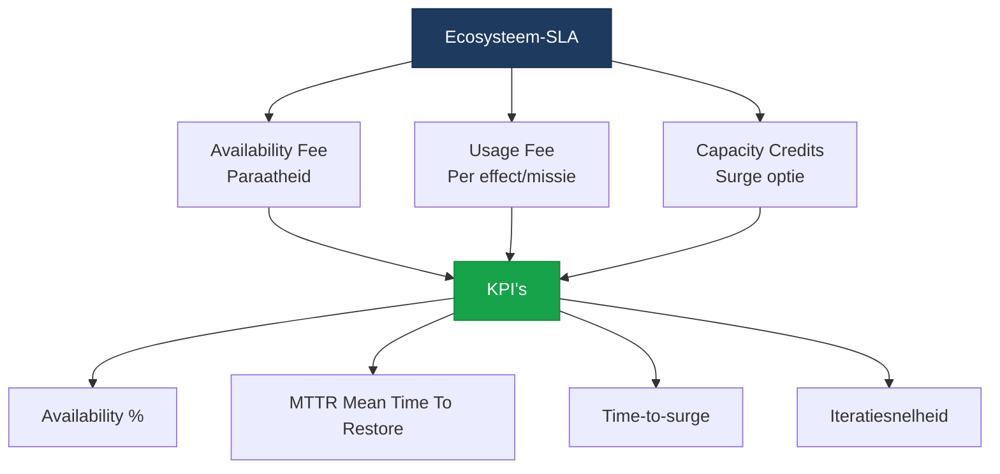
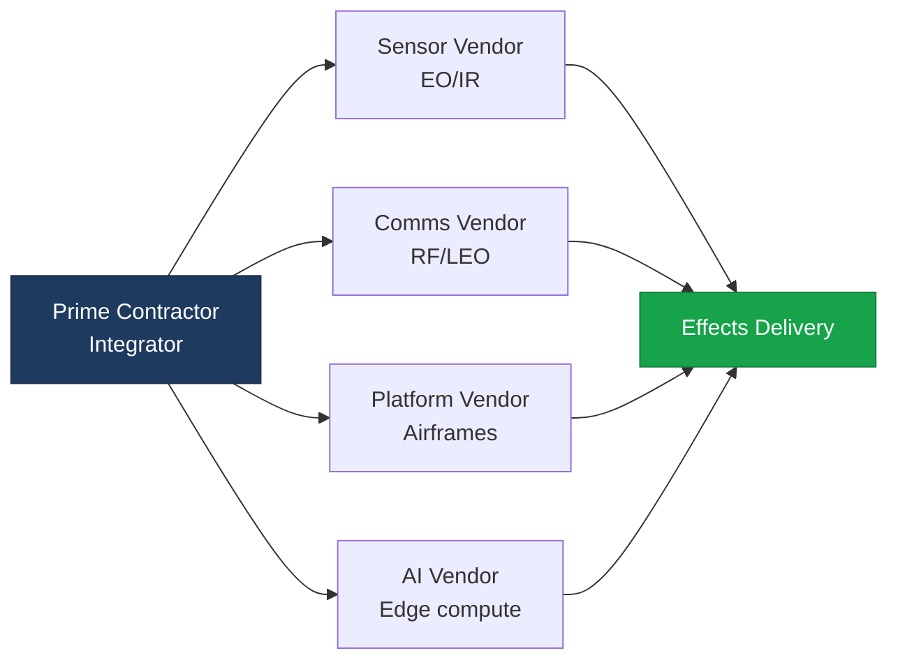

import StatusBanner from '@site/src/components/StatusBanner';
import KpiBadge from '@site/src/components/KpiBadge';

<StatusBanner status="concept" versie="0.9" datum="2025-10" />

# Ecosysteem-SLA's — Outcome-based Contracten

## Van Platform Procurement naar Ecosysteem-SLA's

**Oud model:** Koop X aantal platforms voor €Y
**Nieuw model:** Koop **effects + surge capacity** met outcome-based KPI's

### Waarom?

Traditionele procurement focust op **inputs** (hoeveel platforms), niet **outputs** (welke effecten).

**Problems met oud model:**
- Lange procurement cycles (5-10 jaar)
- Vendor lock-in (proprietary interfaces)
- Geen incentive voor snelle iteratie
- Peacetime inventory ≠ wartime surge

**Ecosysteem-SLA voordelen:**
- Betaal voor **availability** + **effects**
- Vendor incentive voor **uptime** en **iteratie**
- Flexibiliteit (upgrade tijdens contract)
- Surge capacity ingebouwd

---

## Ecosysteem-SLA Structuur



### Drie Componenten

1. **Availability Fee** — Jaarlijkse fee voor paraatheid
2. **Usage Fee** — Betaling per missie/effect
3. **Capacity Credits** — Vooraf betaalde surge optie

---

## KPI's in Ecosysteem-SLA's

### 1. Availability (Paraatheid)

**Metric:** % van tijd dat systeem operationeel is

<KpiBadge label="Target" value="≥ 95%" variant="ok" />
<KpiBadge label="Warning" value="90-95%" variant="warn" />
<KpiBadge label="Breach" value="< 90%" variant="bad" />

**Penalties:**
- 90-95%: 10% korting op availability fee
- 85-90%: 25% korting
- < 85%: 50% korting + remediation plan vereist

**Example: ISR Coverage**
```
Contract: 24/7 ISR coverage over Baltic (10.000 km²)
Availability target: ≥ 95%
Measurement: Uptime van sensor coverage
Reporting: Real-time dashboard + maandelijks rapport
```

### 2. MTTR (Mean Time To Restore)

**Metric:** Gemiddelde tijd om failed systeem te herstellen

<KpiBadge label="Target" value="≤ 4 uur" variant="ok" />
<KpiBadge label="Warning" value="4-8 uur" variant="warn" />
<KpiBadge label="Breach" value="> 8 uur" variant="bad" />

**Includes:**
- Fault detection time
- Logistics (spare parts)
- Repair/replacement time
- Return to service

**Example: Drone Swarm**
```
MTTR target: ≤ 4 uur
Failure: 1 drone uit swarm van 20 crasht
Response:
  - T+30 min: Fault detected (telemetry)
  - T+2 uur: Replacement drone deployed
  - T+3 uur: Swarm fully operational
MTTR: 3 uur ✅
```

### 3. Time-to-Surge

**Metric:** Tijd om productie 10x te maken

<KpiBadge label="Target" value="≤ 6 weken" variant="ok" />
<KpiBadge label="Warning" value="6-12 weken" variant="warn" />
<KpiBadge label="Breach" value="> 12 weken" variant="bad" />

**Measured by:**
- Quarterly surge drills (test activatie)
- Supply chain audits
- Tooling readiness checks

### 4. Iteratiesnelheid

**Metric:** Nieuwe features/updates per kwartaal

<KpiBadge label="Target" value="≥ 2/kwartaal" variant="ok" />
<KpiBadge label="Warning" value="1/kwartaal" variant="warn" />
<KpiBadge label="Breach" value="< 1/kwartaal" variant="bad" />

**Examples:**
- Software updates (autopilot, AI models)
- Sensor upgrades (nieuwe wavelengths)
- Comms improvements (nieuwe waveforms)

---

## Pricing Model

### Availability Fee (Jaarlijks)

**Base formula:**
```
Availability Fee = (Platform Cost × Availability Target × Risk Factor)
```

**Example: Tactical Drone Swarm**
```
Platform cost: €50K/drone × 100 drones = €5M
Availability target: 95%
Risk factor: 15% (includes tooling, supply chain)
Availability Fee: €5M × 0.95 × 0.15 = €712K/jaar
```

### Usage Fee (Per Missie)

**Base formula:**
```
Usage Fee = (Operational Cost × Mission Duration) + Depreciation
```

**Example: ISR Mission**
```
Operational cost: €500/uur (sensors, comms, personnel)
Mission duration: 24 uur
Depreciation: €1K (wear & tear)
Usage Fee: (€500 × 24) + €1K = €13K/missie
```

### Capacity Credits

**Prepaid surge option:**
```
Capacity Credit = (Surge Production Cost × Credit Factor)
Credit Factor = 10-20% (reserve cost)
```

**Example:**
```
Surge production: 1000 drones @ €50K = €50M
Credit factor: 15%
Capacity Credit (annual): €7.5M/jaar
```

**Activation:**
- Credits worden "gespent" bij daadwerkelijke surge productie
- Resterende 85% wordt betaald bij levering

---

## Contract Voorbeeld

### ISR Coverage — Baltic Region

**Scope:** 24/7 ISR coverage, 10.000 km², EO/IR/SAR sensors

**KPI's:**
- Availability: ≥ 95%
- MTTR: ≤ 4 uur
- Time-to-surge: ≤ 6 weken (10x capacity)
- Iteraties: ≥ 2/kwartaal (software, sensor upgrades)

**Pricing:**
| Component | Annual Cost |
|-----------|-------------|
| Availability Fee | €2.5M |
| Usage Fee | €50K/dag × 365 = €18.25M |
| Capacity Credits | €5M (surge optie) |
| **Total** | **€25.75M/jaar** |

**Penalties:**
- Availability < 95%: Proportional refund
- MTTR > 4 uur: €10K/incident
- Surge drill failure: €100K + remediation plan

**Bonuses:**
- Availability > 98%: 5% bonus
- Iteratiesnelheid > 3/kwartaal: €50K bonus

---

## Multi-vendor Ecosysteem

**One ecosystem-SLA kan multiple vendors bevatten:**



**Prime Contractor** is verantwoordelijk voor:
- Overall availability
- Integration tussen vendors
- MTTR coördinatie
- Surge capacity activatie

**Sub-vendors** leveren:
- Specifieke componenten (sensors, comms, etc.)
- Module-level SLA's
- Open interfaces (geen lock-in)

---

## Governance & Transparency

### Real-time Dashboard

Alle stakeholders (overheid, prime, sub-vendors) hebben toegang tot:
- **Availability metrics** (live uptime)
- **MTTR tracking** (incident logs)
- **Surge readiness** (tooling status, supply chain)
- **Iteratie roadmap** (planned updates)

### Monthly Reviews

- Performance tegen KPI's
- Penalty/bonus calculations
- Upcoming iterations
- Surge drill planning

### Quarterly Surge Drills

Test van time-to-surge capability:
1. Simulate escalation scenario
2. Activate capacity credits
3. Measure response time
4. Identify bottlenecks

---

## Kapitaalmarkt (Zuidas) Fit

**Why investors care:**
- **Recurring revenue** (availability fees)
- **Predictable cash flow** (multi-year contracts)
- **Dual-use leverage** (civiel + militair)
- **Strategic importance** (government backing)

**Investor pitch:**
```
Contract: €25M/jaar, 5 jaar = €125M total
Availability fee: €2.5M/jaar (recurring)
Gross margin: 30-40% (services model)
Dual-use upside: Civiele ISR, SAR, mapping
```

---

**Next:** [06 — Capacity Credits](./capacity-credits)
