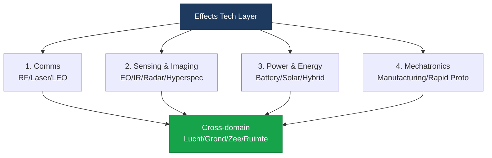

import StatusBanner from '@site/src/components/StatusBanner';
import KpiBadge from '@site/src/components/KpiBadge';

<StatusBanner status="concept" versie="0.9" datum="2025-10" />

# Effects Tech Layer — Cross-domein Architectuur

## Concept

De **Effects Tech Layer** is een **horizontale tech stack** die cross-domein werkt (lucht, grond, zee, ruimte) in plaats van verticale platform-specifieke oplossingen.

**Waarom?**
- **Herbruikbaarheid** — dezelfde sensing module werkt in drone, USV, ground robot
- **Interoperability** — open interfaces tussen JEF landen
- **Surge capacity** — modulaire productie schaalt sneller
- **Tech sovereignty** — geen vendor lock-in
- **Cost efficiency** — economies of scale over domeinen heen

## Vier Bouwblokken

### 1 — Communications (Comms)

**RF/Laser/LEO Mesh Networks**

| Technology | Use Case | Status |
|------------|----------|--------|
| **RF Mesh** | Tactical nets, MANET | <KpiBadge label="Maturity" value="TRL 7-8" variant="ok" /> |
| **Free Space Optical (FSO/Laser)** | High-bandwidth LOS comms | <KpiBadge label="Maturity" value="TRL 6-7" variant="warn" /> |
| **LEO Satcom** | Beyond-LOS, global coverage | <KpiBadge label="Maturity" value="TRL 8-9" variant="ok" /> |
| **5G/6G Tactical** | High-density, low-latency | <KpiBadge label="Maturity" value="TRL 5-6" variant="warn" /> |

**Key Requirements:**
- **Anti-jam** (spread spectrum, frequency hopping)
- **Low Probability of Intercept (LPI)**
- **Mesh networking** (self-healing topologies)
- **Interoperability** (NATO STANAG 4677, 7085)

**Dual-use:**
- Civiel: 5G private networks, emergency comms
- Militair: Tactical mesh, SATCOM

### 2 — Sensing & Imaging

**EO/IR/Radar/Hyperspectral + AI-edge**

| Sensor Type | Resolution | Dual-use |
|-------------|------------|----------|
| **Electro-Optical (EO)** | 1-10cm GSD | Civiel: mapping, agricultuur |
| **Infrared (IR)** | Thermal, SWIR/MWIR/LWIR | Civiel: firefighting, SAR |
| **Radar (SAR)** | All-weather, 1m GSD | Civiel: disaster monitoring |
| **Hyperspectral** | 100+ bands | Civiel: mineral exploration |
| **LiDAR** | 3D point clouds | Civiel: infrastructure, forestry |

**AI-Edge Processing:**
- **Object detection** (vehicles, personnel)
- **Classification** (friend/foe, target type)
- **Change detection** (movement, new structures)
- **Fusion** (multi-sensor data integration)

**Edge compute vereisten:**
- Low power (less than 10W voor drone-mounted)
- Real-time inference (less than 100ms latency)
- Ruggedized (IP67, -40°C tot +70°C)

### 3 — Power & Energy Materials

**Battery Packs, Solar, Hybrid Power Systems**

| Technology | Energy Density | Use Case |
|------------|----------------|----------|
| **Li-ion** | 250 Wh/kg | General purpose |
| **Li-polymer** | 200 Wh/kg | Form factor flexibility |
| **Solid-state** | 400+ Wh/kg (future) | Long endurance |
| **Hydrogen fuel cells** | 600 Wh/kg | Extended range |
| **Solar** | 200 W/m² (space-grade) | Persistent platforms |

**Hybrid Power:**
- Combinatie solar + battery voor **persistent ISR**
- Fuel cell + battery voor **long-range strike**
- Tactical charging (rapid swap, inductive)

**Dual-use:**
- Civiel: EV batteries, grid storage
- Militair: Drone endurance, ground vehicles

### 4 — Mechatronics & Manufacturing

**Rapid Prototyping, Modular Production, Supply Chain**

| Capability | Time-to-production | Dual-use |
|------------|-------------------|----------|
| **Additive Manufacturing (3D print)** | Uren tot dagen | Civiel: spare parts, tooling |
| **CNC Machining** | Dagen tot weken | Civiel: aerospace, automotive |
| **Composite Layup (automated)** | Weken | Civiel: wind turbines, aerospace |
| **Electronics Assembly (SMT)** | Uren | Civiel: consumer electronics |

**Key Enablers:**
- **Digital twins** voor rapid iteration
- **Modular designs** voor snelle assembly
- **Pre-positioned tooling** in JEF landen
- **Supply chain transparency** (geen single points of failure)

---

## Cross-domain Toepassingen

### Voorbeeld: ISR Module

Dezelfde **sensing module** kan worden ingezet in:

| Platform | Domain | Mounting | Power |
|----------|--------|----------|-------|
| Fixed-wing drone | Air | Gimbal | Battery |
| Ground UGV | Land | Mast | Battery + solar |
| USV (unmanned surface vessel) | Sea | Stabilized mount | Hybrid |
| LEO satellite | Space | Fixed | Solar |

**Voordelen:**
- **1 ontwikkeltraject** → 4 platforms
- **Shared supply chain**
- **Interoperable data formats**
- **Faster time-to-surge** (modulaire productie)

### Voorbeeld: Comms Module

Dezelfde **RF mesh radio** kan werken op:
- Drone-to-drone mesh
- Ground soldier to vehicle
- USV to shore station
- Cross-domain (air-to-ground)

**Standards:**
- NATO STANAG 4677 (Tactical Data Link)
- STANAG 7085 (Digital Communications)
- Open APIs voor vendor interop

---

## Industrial Base Implicaties

### JEF Specialisaties

| Land | Specialisatie | Bijdrage aan Tech Layer |
|------|---------------|------------------------|
| **UK** | Sensors, AI, satcom | Sensing module lead |
| **NL** | Semiconductors, photonics | Edge compute, FSO comms |
| **SE** | Defense platforms, sensors | Radar, EO/IR integration |
| **FI** | Drone tech, autonomy | Autonomy stack, swarm |
| **NO** | Energy, maritime | Hybrid power, USV |
| **DK** | Maritime, logistics | Integration, testing |

### Kapitaalmarkt (Zuidas) Focus

Dual-use tech met kapitaalmarkt potentie:
- **EO/IR sensors** (civiele mapping, agriculture)
- **Edge AI** (autonomous vehicles, robotics)
- **Mesh networking** (5G private networks, IoT)
- **Battery tech** (EV, grid storage)

---

## KPI's voor Effects Tech Layer

<KpiBadge label="Time-to-surge" value="≤ 6 weken" variant="ok" />
<KpiBadge label="Cross-domain reuse" value="≥ 70%" variant="ok" />
<KpiBadge label="Open interfaces" value="100%" variant="ok" />
<KpiBadge label="Dual-use %" value="≥ 50%" variant="ok" />
<KpiBadge label="JEF interoperability" value="NATO STANAG" variant="ok" />

---

**Next:** [04 — Surge Capacity](./surge-capacity)
