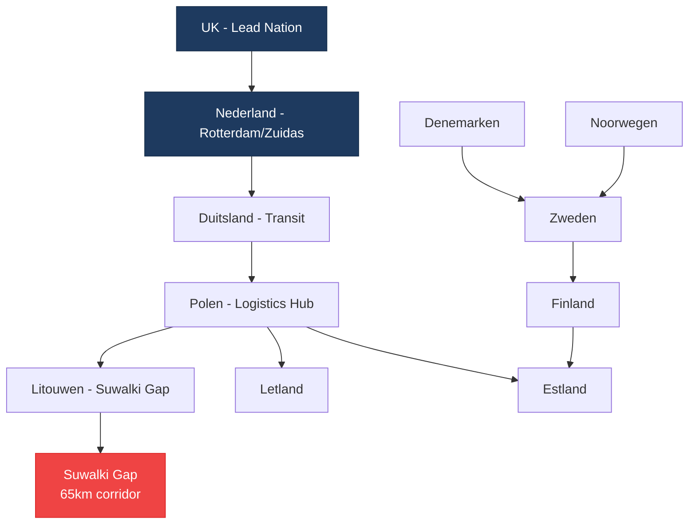

import StatusBanner from '@site/src/components/StatusBanner';

<StatusBanner status="concept" versie="0.9" datum="2025-10" />

# JEF, Baltics & Routes

## Joint Expeditionary Force (JEF)

De **Joint Expeditionary Force** is een UK-led coalition van 10 landen gericht op rapid deployment en high-readiness operations.

### JEF Landen

| Land | Code | Rol |
|------|------|-----|
| **United Kingdom** | UK | Lead nation, framework provider |
| **Nederland** | NL | Naval, logistics, tech hub (Zuidas) |
| **Denemarken** | DK | Naval, Baltic access, Greenland |
| **Zweden** | SE | Baltic Sea control, tech/defense industry |
| **Noorwegen** | NO | Northern flank, Arctic, oil/gas infrastructure |
| **Finland** | FI | Baltic, land forces, drone tech |
| **Estland** | EE | Baltic frontline, cyber, digital gov |
| **Letland** | LV | Baltic frontline, logistics hub |
| **Litouwen** | LT | Baltic frontline, Suwalki Gap |
| **IJsland** | IS | Atlantic, GIUK gap, sensor networks |

**Totaal:** ~350M inwoners, €3.5T+ GDP, significant tech/defense industrial base.

## Baltic Focus

De Baltic regio is **strategisch kritiek** voor:

1. **NATO's oostflank** — Article 5 verplichtingen EE/LV/LT
2. **Suwalki Gap** — 65km corridor tussen Belarus en Kaliningrad
3. **Baltic Sea** — maritime access, energy infrastructure
4. **Drone Wall** — nieuwe defensieve infrastructuur langs oostgrens

### Drone Wall Context

De **Drone Wall** is een initiatief voor:
- **Persistent surveillance** langs oostelijke grens
- **Area denial** met autonome systemen
- **Rapid response** bij incursions
- **Dual-use tech** (civiel + militair)

Dit is een **perfect use case** voor Effects Tech Layer + Surge Capacity model.

## Critical Routes & Corridors

### Suwalki Gap

De **Suwalki Gap** is een 65km breed corridor tussen **Belarus** en **Kaliningrad** (RU exclave).

**Waarom kritiek?**
- Enige land-verbinding tussen Polen en Baltic staten
- Potentieel choke point bij conflict
- Vereist **rapid reinforcement** capability
- Ideale testcase voor **drone-based area denial**

### Maritime Routes

**Baltic Sea Access:**
- **Danish Straits** (Great Belt, Little Belt, Øresund)
- **Kiel Canal** (Duitsland)
- **Finnish Gulf** (FI-EE)

**North Sea / Atlantic:**
- **GIUK Gap** (Greenland-Iceland-UK)
- **Norwegian Sea** (energy infrastructure)
- **North Sea** (wind farms, gas fields)

### Energy Infrastructure

Critical energy routes:
- **Nord Stream** (damaged, not operational)
- **Baltic Pipe** (NO → PL via DK)
- **LNG terminals** (NL, PL, FI, LT)
- **Wind farms** (North Sea, Baltic)

Deze infrastructuur vereist **persistent surveillance** en **rapid response** — perfect voor Effects Tech Layer.

## JEF + DTDA Alignment

| Aspect | JEF Framework | DTDA Contribution |
|--------|---------------|-------------------|
| **Command** | UK-led | Tech/industrial policy input |
| **Logistics** | Multinational hubs | Surge capacity, availability fees |
| **Tech** | Platform-agnostic | Effects Tech Layer |
| **Funding** | National budgets | Kapitaalmarkt (Zuidas), capacity credits |
| **Interop** | NATO standards | Open architectures, multi-vendor |
| **Focus** | Rapid deployment | Time-to-surge ≤ 6 weken |

## Key Enablers

Voor effectieve JEF + Baltic operations zijn nodig:

1. **Pre-positioned stocks** in PL/LT/LV/EE
2. **Capacity credits** met Nederlandse/Zweedse/Finse industrie
3. **Availability fees** voor surge readiness
4. **Open architectures** voor cross-border interop
5. **Kapitaalmarkt access** (Zuidas) voor dual-use tech funding

---

**Next:** [03 — Effects Tech Layer](./effects-tech-layer)
