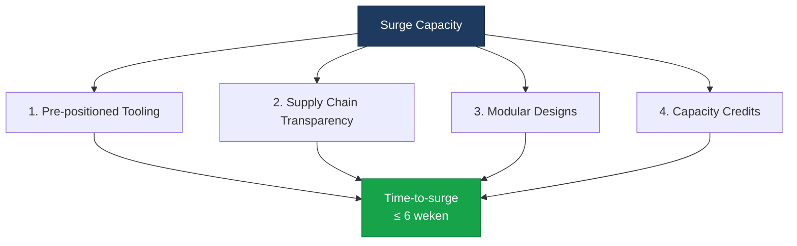

import StatusBanner from '@site/src/components/StatusBanner';
import KpiBadge from '@site/src/components/KpiBadge';

<StatusBanner status="concept" versie="0.9" datum="2025-10" />

# Surge Capacity — Opschaalvermogen

## Definitie

**Surge Capacity** = het vermogen om productie te vertienvoudigen binnen <KpiBadge label="Time-to-surge" value="≤ 6 weken" variant="ok" />.

**Waarom kritiek?**
- Modern conflict escaleert sneller dan industriële productie kan opschalen (Ukraine lessen)
- Peacetime aantallen zijn **niet relevant** — surge capacity is
- **Time-to-surge** is belangrijker dan **inventory levels**

## Time-to-Surge als KPI

**Oud denken:** "Hoeveel platforms hebben we op voorraad?"
**Nieuw denken:** "Hoe snel kunnen we productie 10x maken?"

### Benchmark: Ukraine Conflict

| Platform Type | Peacetime Production | Wartime Need | Time to Scale |
|---------------|---------------------|--------------|---------------|
| Artillery shells | 100K/jaar (EU) | 1M+/jaar | <KpiBadge label="Actual" value="18+ maanden" variant="bad" /> |
| Tactical drones | 1K/maand | 10K+/maand | <KpiBadge label="Actual" value="12+ maanden" variant="bad" /> |
| MANPADS | 100/maand | 1K+/maand | <KpiBadge label="Actual" value="24+ maanden" variant="bad" /> |

**Waarom zo traag?**
1. Supply chain dependencies (Asia, US)
2. Tooling niet pre-positioned
3. Specialized labor shortages
4. Regulatory bottlenecks (export controls, ITAR)

**DTDA target:** <KpiBadge label="Time-to-surge" value="≤ 6 weken" variant="ok" />

## Vier Pijlers van Surge Capacity



### 1. Pre-positioned Tooling

**What:** Productieapparatuur en tooling pre-positioned in JEF landen, klaar om te activeren.

**Examples:**
- CNC machines (idle maar onderhouden)
- Additive manufacturing (3D printers)
- Electronics assembly lines (SMT pick-and-place)
- Composite layup tooling

**Locations:**
- **NL** — Electronics, photonics (Eindhoven, Twente)
- **SE** — Defense platforms (Linköping, Karlskoga)
- **FI** — Drone manufacturing (Tampere, Oulu)
- **PL** — Assembly, logistics (Warsaw, Gdańsk)

**Funding:** **Availability fees** voor tooling paraatheid (zie Ecosysteem-SLA's).

### 2. Supply Chain Transparency

**Problem:** Huidige supply chains zijn **black boxes** met SPOF (single points of failure).

**Solution:** **Digital supply chain twins** met transparency over:
- Critical components (semiconductors, batteries, sensors)
- Lead times
- Geographic dependencies
- Alternative suppliers

**Tools:**
- Supply chain mapping software
- Tier-2/Tier-3 visibility
- Risk scoring (geopolitical, climate, logistics)

**Example:**
```
Component: Edge AI processor
├─ Tier 1: NXP (NL)
├─ Tier 2: TSMC (TW) ⚠️ Geopolitical risk
├─ Tier 3: ASML (NL) lithography
└─ Alternative: Intel (US/EU fabs)
```

### 3. Modular Designs

**Concept:** Platform designs moeten **modular** zijn voor snelle assembly/reconfiguration.

**Example: Tactical Drone**
```
Platform
├─ Airframe (composite, 3D printed)
├─ Propulsion (COTS motors + ESC)
├─ Power (modular battery pack)
├─ Sensing (plug-and-play EO/IR)
├─ Comms (modular RF/LEO)
└─ Autopilot (open-source stack)
```

**Benefits:**
- **Parallel production** van modules
- **Rapid iteration** (swap sensor, upgrade comms)
- **Repair/refurb** (module replacement)
- **Interoperability** (cross-JEF gebruik)

### 4. Capacity Credits

**What:** **Vooraf betaalde productiecapaciteit** bij suppliers.

**How it works:**
1. Overheid koopt **capacity credits** (bv. "1000 drone equivalents")
2. Supplier houdt tooling/supply chain gereed
3. Bij activatie: productie start binnen **≤ 1 week**
4. Credits worden "gespent" bij daadwerkelijke productie

**Analog:** Cloud computing reserved instances.

**Pricing:**
- **Capacity fee** (10-20% van productiekosten, jaarlijks)
- **Activation fee** (resterende 80-90%, bij daadwerkelijke productie)

**Example:**
- 1000 tactical drones @ €50K = €50M productiewaarde
- Capacity fee: €7.5M/jaar (15%)
- Activation: €42.5M bij daadwerkelijke productie

---

## Surge Scenarios

### Scenario 1: Baltic Escalation

**Trigger:** Russian incursion in Suwalki Gap

**Response:**
1. **T+0 uur:** Activation van capacity credits (NL, SE, FI suppliers)
2. **T+1 week:** Eerste batch tactical drones (500 units)
3. **T+3 weken:** ISR coverage operational over Suwalki
4. **T+6 weken:** Full surge production (5K drones/maand)

### Scenario 2: Drone Wall Expansion

**Trigger:** Need to extend Drone Wall van Baltic naar North Sea

**Response:**
1. **T+0:** Activate pre-positioned sensors (NL, DK stocks)
2. **T+2 weken:** Deploy persistent ISR layer
3. **T+4 weken:** Integrated air picture operational
4. **T+6 weken:** Full coverage + redundancy

---

## KPI's voor Surge Capacity

<KpiBadge label="Time-to-surge" value="≤ 6 weken" variant="ok" />
<KpiBadge label="Productie scale factor" value="10x" variant="ok" />
<KpiBadge label="Supply chain transparency" value="Tier-2 visibility" variant="ok" />
<KpiBadge label="Capacity credits activated" value="≥ €500M" variant="warn" />
<KpiBadge label="Pre-positioned tooling" value="5 JEF landen" variant="ok" />

---

## Industriële Implications

### Supplier Requirements

Om deel te nemen aan surge capacity programma:

✅ **Supply chain transparency** (Tier-2 visibility minimum)
✅ **Modular designs** (plug-and-play componenten)
✅ **Pre-positioned tooling** commitment
✅ **Capacity credits** contracten
✅ **Open architectures** (geen vendor lock-in)
✅ **Dual-use** (civiele + militaire toepassingen)

### Financing (Zuidas)

**Dual-use suppliers** kunnen kapitaalmarkt gebruiken voor:
- **Pre-positioned tooling** CAPEX
- **Supply chain resilience** investeringen
- **R&D** voor modular designs

**Investor pitch:**
- Overheidsopdrachten via capacity credits
- Dual-use revenue (civiel + militair)
- Strategic importance (defense + economic security)

---

**Next:** [05 — Ecosysteem-SLA's](./ecosysteem-slas)
