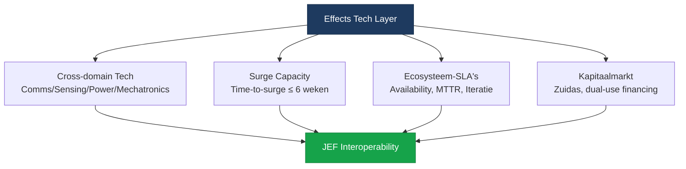

import StatusBanner from '@site/src/components/StatusBanner';

<StatusBanner status="concept" versie="0.9" datum="2025-10" />

# DUOS-waardeketen — Kritiek op Oude Aannames

## DUOS = Dual Use, Onbemand, BVLOS

**DUOS-waardeketen** is een framework dat **verkeerde aannames** maakt over hoe de drone/autonome systemen industrie werkt.

**Probleem:** Het frame is bedacht door de **gevestigde orde** (piloten, luchtverkeersleiding, bemande luchtvaart lobby) om **hun monopolie te beschermen**.

---

## Drie Foute Aannames

### 1. "Dual Use" als aparte categorie

#### Aanname (fout)
**"Dual-use is een speciale categorie die apart moet worden behandeld."**

Dit suggereert dat dual-use **anders** is dan pure civiel of pure militair.

#### Waarom fout?
**Bijna alle moderne tech is dual-use:**
- Semiconductors (phones + missiles)
- AI (self-driving cars + targeting)
- Comms (5G + tactical mesh)
- Sensors (agriculture + ISR)

**"Dual-use" is niet bijzonder — het is de norm.**

Door het als "special" te framen, creëer je:
- Extra bureaucratie (export controls)
- Slower innovation (regulatory lag)
- Separation van markets (smaller TAM)

#### Correct Frame
**"Tech is tech — toepassingen zijn divers."**

Stop met labeling "dual-use" alsof het een **probleem** is. Het is een **feature**:
- Grotere market (civil + military)
- Faster iteration (more users)
- Economies of scale

**Governance:** Export controls waar nodig, maar **not by default**.

---

### 2. "Onbemand" als definitie

#### Aanname (fout)
**"Onbemand is het definiërende kenmerk van deze systemen."**

DUOS gebruikt "Onbemand" (unmanned) als kernbegrip.

#### Waarom fout?
**"Onbemand" is een **negatieve definitie** — het zegt wat iets **niet** is, niet wat het **wel** is.**

**Problems:**
- Focust op **absence** (geen pilot) ipv **capability** (autonomous, sensor-rich)
- Suggereert dat "bemand" de norm is (piloten-framing)
- Ignoreert spectrum (teleoperated → supervised → fully autonomous)

**Voorbeeld:**
- Is een autonome auto "onbemand"? (Nee, er zit een passagier in.)
- Is een commercial airliner "onbemand"? (Nee, maar het is 95% autopilot.)

**"Onbemand" is een oversimplificatie.**

#### Correct Frame
**"Autonomous / Supervised / Teleoperated — met verschillende levels."**

Focus op **what the system can do:**
- **Level 0:** Fully manual (RC)
- **Level 1:** Assisted (autopilot hold altitude)
- **Level 2:** Partial autonomy (waypoint nav)
- **Level 3:** Conditional autonomy (RTL on signal loss)
- **Level 4:** High autonomy (mission planning, obstacle avoidance)
- **Level 5:** Full autonomy (swarm coordination, adaptive tactics)

**Governance:** Regulate based on **autonomy level** + **risk**, not "bemand vs. onbemand".

---

### 3. "BVLOS" als centrale concept

#### Aanname (fout)
**"BVLOS (Beyond Visual Line of Sight) is de key unlock voor scaling drones."**

DUOS maakt BVLOS central to the framework.

#### Waarom fout?

**A. "Visual Line of Sight" is irrelevant voor modern systems.**

Moderne drones/autonome systems gebruiken:
- **Sensors** (EO/IR/Radar, 10+ km range)
- **Datalinks** (RF/LEO, 100+ km range)
- **Cooperative awareness** (ADS-B, mesh)

**"Visual" is een archaïsch concept** uit bemande luchtvaart (waar pilot inderdaad met ogen kijkt).

**B. BVLOS is geframed door piloten-lobby.**

BVLOS regels zijn bedacht om **piloten** te beschermen:
- Slow regulatory approval (years)
- Expensive compliance (observers, chase aircraft)
- Preserves pilot monopoly

**C. Militair is BVLOS irrelevant.**

Military operations zijn **altijd** "beyond visual" — niemand ziet een F-35 op 50km afstand.

BVLOS is een **civiele regulatory construct**, not a technical barrier.

#### Correct Frame
**Prestatie-gebaseerde modi:**

1. **SLOS-DAA** (Sensor Line of Sight + Detect & Avoid)
   - System heeft sensors (not human eyes)
   - DAA capability (radar, cooperative)

2. **ELOS-COOP** (Electronic Line of Sight, cooperative)
   - Datalink maintained (RF, LEO)
   - Cooperative awareness (ADS-B, transponder)

3. **GEO-ASSURED** (Geografisch/temporeel geborgd)
   - Geografische scheiding (restricted airspace)
   - Temporele scheiding (time blocks)

4. **PROC-SEG** (Procedureel gesegregeerd)
   - Procedural separation (IFR-like)
   - Controlled airspace coordination

**See:** [10 — Prestatie-modi](./prestatie-modi)

---

## DUOS-waardeketen: Wat is het eigenlijk?

**DUOS** claimt een **waardeketen** te beschrijven voor dual-use, unmanned, BVLOS systemen.

### Claimed Waardeketen

```
R&D → Prototyping → Certification → Production → Operations
```

**Problem:** Deze waardeketen is **niet specifiek** voor DUOS — het is **elke tech waardeketen**.

### Wat DUOS mist

**A. Surge Capacity**

DUOS focust op **peacetime production**, niet **wartime surge**.
- Geen mention van time-to-surge
- Geen tooling pre-positioning
- Geen capacity credits

**B. Ecosysteem-SLA's**

DUOS blijft hangen in traditional procurement:
- Koop X platforms
- Geen outcome-based KPI's
- Geen availability fees

**C. Open Architectures**

DUOS heeft geen focus op **interoperability**:
- Vendor lock-in is OK (apparently)
- Proprietary interfaces
- No multi-vendor ecosystems

**D. Kapitaalmarkt**

DUOS heeft geen visie op **financing**:
- Overheidsbudget only
- Geen dual-use capital markets
- Geen investor access

---

## Alternatief Framework: Effects Tech Layer

**In plaats van DUOS:**



**Verschillen met DUOS:**

| Aspect | DUOS | Effects Tech Layer |
|--------|------|-------------------|
| **Focus** | Platforms (drones) | Effects (ISR, area denial) |
| **Definitie** | Dual-use, Onbemand, BVLOS | Cross-domain, prestatie-gebaseerd |
| **Waardeketen** | R&D → Production | Surge capacity, ecosysteem-SLA's |
| **Financiering** | Overheid only | Kapitaalmarkt (dual-use) |
| **Governance** | BVLOS regels (pilots) | Prestatie-modi (tech-based) |
| **Interop** | Not mentioned | JEF-wide open architectures |

---

## Wie profiteert van DUOS-frame?

### 1. Piloten & Luchtverkeersleiding

**Why?**
- BVLOS regels preserveren hun monopoly
- Slow regulatory approval = less competition
- "Onbemand" framing = pilots stay relevant

### 2. Gevestigde Defense Primes

**Why?**
- Traditional procurement (koop platforms)
- Vendor lock-in (proprietary)
- No ecosysteem-SLA's = no pressure for performance

### 3. Bureaucraten

**Why?**
- "Dual-use" creates extra regulatory layers (job security)
- Slow cycles = less accountability
- No transparency requirements

---

## Wie verliest bij DUOS-frame?

### 1. Innovators & Scale-ups

**Why?**
- BVLOS barriers (slow approval, expensive compliance)
- No access to capital markets (dual-use stigma)
- Vendor lock-in favors incumbents

### 2. Military / End Users

**Why?**
- Slow procurement (years)
- No surge capacity (can't scale in crisis)
- Higher costs (vendor lock-in)

### 3. Investors

**Why?**
- "Dual-use" treated as problematic (not opportunity)
- No clear regulatory pathway
- Smaller TAM (civil vs. military separated)

---

## Aanbevelingen

### 1. Stop met "DUOS" terminologie

**Use instead:**
- **"Effects Tech"** (not "dual-use drones")
- **"Autonomous systems"** (not "onbemand")
- **"Prestatie-modi"** (not BVLOS/VLOS)

### 2. Focus op Surge Capacity

**Metrics:**
- Time-to-surge ≤ 6 weken
- Capacity credits
- Pre-positioned tooling

### 3. Ecosysteem-SLA's als default

**Procurement:**
- Availability, MTTR, iteratiesnelheid
- Not: koop X platforms

### 4. Kapitaalmarkt access

**Financing:**
- Zuidas dual-use fund
- Euronext IPO pathway
- Investor transparency (TLP framework)

---

**Next:** [10 — Prestatie-modi](./prestatie-modi)
