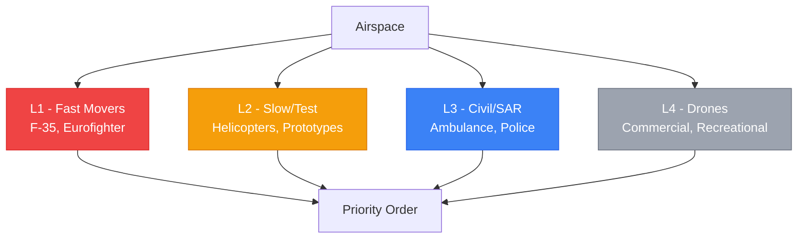

import StatusBanner from '@site/src/components/StatusBanner';

<StatusBanner status="concept" versie="0.9" datum="2025-10" />

# L1-L4 Prioritering — Airspace Hierarchy

## Hierarchical Airspace Allocation

**Oud denken:** "Democratisch" — alle airspace users zijn gelijk.
**Nieuw denken:** **Priority levels** — fast movers first, drones last.

---

## Priority Levels

### L1 — Fast Movers
**Aircraft:** F-35, Eurofighter, combat jets
**Priority:** **Absolute** — altijd voorrang
**Speed:** 500+ knots
**Altitude:** All levels (including low-level training)

**Why L1?**
- National security (QRA, air policing)
- Safety (high kinetic energy)
- Training necessity (low-level, high-speed)

### L2 — Slow Movers + Test
**Aircraft:** Helicopters, transport, test platforms
**Priority:** **High** — yield to L1 only
**Speed:** Less than 200 knots
**Altitude:** Typically less than 10,000 ft

**Includes:**
- Military helicopters (SAR, transport)
- Test platforms (new aircraft, prototypes)
- Trainers (C-130, transports)

### L3 — Civil + SAR
**Aircraft:** Ambulance, police, firefighting, commercial
**Priority:** **Medium** — yield to L1/L2
**Speed:** Less than 150 knots
**Altitude:** Less than 5,000 ft (typically)

**Use cases:**
- Medical (HEMS, ambulance)
- Law enforcement
- Search & Rescue
- Commercial (cargo, inspection)

### L4 — Drones
**Aircraft:** Commercial drones, recreational UAVs
**Priority:** **Low** — yield to all
**Speed:** Less than 100 knots
**Altitude:** Less than 500 ft (typically)

**Default:** Lowest priority, must deconflict with all other traffic.

---

## Operational Rules

### Deconfliction

**When conflict:**
1. **L4 yields to L3, L2, L1** (always)
2. **L3 yields to L2, L1**
3. **L2 yields to L1**
4. **L1 has absolute priority**

**How:**
- **Altitude separation** (drones below 500 ft)
- **Geographic separation** (restricted areas)
- **Temporal separation** (time windows)
- **Procedural** (NOTAM, UTM coordination)

### Dynamic Airspace Allocation

**Normal conditions:**
- L4 (drones) can operate in allocated blocks
- L3 (civil/SAR) coordinates via UTM
- L2 (slow/test) files flight plans
- L1 (fast movers) has priority lanes

**During escalation (military exercise, QRA):**
- L1 takes precedence → L4 must ground
- L2/L3 coordinate with military ATC
- Dynamic NOTAMs issued

---

## Example: Baltic Scenario

**Scenario:** Russian bomber approaches Baltic airspace → QRA (Quick Reaction Alert) F-35 scramble.

**Response:**

| Level | Action | Timeframe |
|-------|--------|-----------|
| **L1 (F-35 QRA)** | Immediate takeoff, priority routing | T+0 min |
| **L2 (Heli training)** | Hold position, coordinate | T+2 min |
| **L3 (HEMS ambulance)** | Reroute if in conflict zone | T+5 min |
| **L4 (Commercial drones)** | **Ground all ops in 50 NM radius** | T+0 min (auto via UTM) |

**Result:** L1 gets unimpeded access, others adapt/ground.

---

## Why This Matters

**Current "democratic" system:**
- Gridlock (everyone waits for everyone)
- Safety issues (drones interfere with fast movers)
- Inefficiency (L1 can't train freely)

**L1-L4 system:**
- **Clear hierarchy** (no ambiguity)
- **Safety** (fast movers never impeded)
- **Efficiency** (L4 operates when safe, grounds when not)

---

**Next:** [12 — Tech-soevereiniteit](./tech-soevereiniteit)
